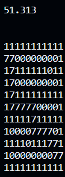
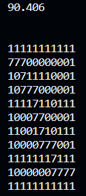
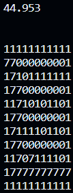

# Курсач: генерация лабиринта и нахождения крачайщего пути из него 

Алгоритм поиска основан на случайных числах определяющих направление движения 

> ## Результаты:
> ### 1 - стены
> ### 0 - свободное простраство
> ### 7 - путь найденный алгоритмом 
> 
>
>
>

